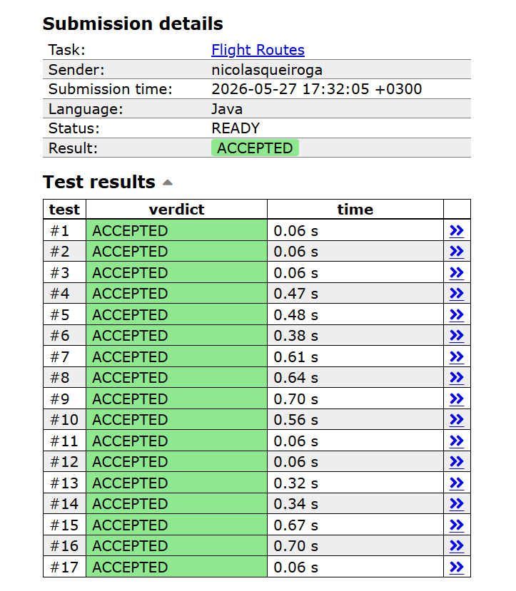

# Trabalho Prático 2 — Caminhos Mínimos (Dijkstra)

## Problema

- **Nome:** Flight Routes
- **Plataforma:** CSES Problem Set
- **Link:** <https://cses.fi/problemset/task/1196>
- **Grupo:** J — *variação de `k` menores caminhos*

## Integrantes do grupo

- Nícolas Queiroga
- Mauricio Oliveira
- João Lucas

## Linguagem utilizada

Java (testado com OpenJDK 21). Apenas estruturas nativas da linguagem foram
usadas como apoio (`ArrayList`, `PriorityQueue`). **Nenhuma biblioteca de grafos
ou de caminhos mínimos foi utilizada** — toda a lógica de Dijkstra, relaxamento,
controle de distâncias e a variação dos `k` menores caminhos foi implementada
pelo grupo.

## Como executar

A partir da pasta `T2/`:

```bash
# compilar
javac src/Main.java -d build

# executar lendo da entrada padrão
java -cp build Main < dados/entradas_do_problema.txt
```

Saída esperada para o exemplo (`dados/entradas_do_problema.txt`):

```text
4 4 7
```

(igual ao conteúdo de `dados/saida_esperada.txt`).

### Submissão no CSES

A solução é um **único arquivo** `src/Main.java`, o que atende ao CSES (que
aceita apenas um arquivo `.java` por submissão). Basta enviar esse mesmo arquivo
em <https://cses.fi/problemset/task/1196> com a linguagem **Java**.

## Modelagem do problema

| Elemento do enunciado | Modelagem em grafo |
| --- | --- |
| Cidades (`1..n`) | Vértices |
| Voos de mão única (`a → b`) | Arestas **direcionadas** |
| Preço do voo (`c`) | Peso da aresta (≥ 1, **não negativo**) |
| Syrjälä (cidade 1) | Origem |
| Metsälä (cidade n) | Destino |
| "as `k` rotas mais baratas" | Os `k` menores custos de caminho de 1 até n |

- **Representação:** dígrafo ponderado por **listas de adjacência** (`List<long[]>[] adj`,
  cada aresta é `{destino, peso}`), adequada porque o grafo é esparso (`m ≈ V`).
- As rotas **podem repetir cidades**, então não buscamos caminhos simples: o
  espaço de soluções inclui caminhos que reusam vértices/arestas.
- Como **todos os pesos são não negativos** (`1 ≤ c ≤ 10⁹`), Dijkstra é aplicável.

## Algoritmo utilizado

**Dijkstra com fila de prioridade mínima**, na variação para **`k` menores
caminhos** (k-shortest paths por contagem de extrações).

### Variação de Dijkstra usada

No Dijkstra clássico cada vértice é finalizado **uma vez** (a primeira extração
da fila fixa a menor distância). Para obter os `k` menores custos até o destino,
permitimos que cada vértice seja finalizado **até `k` vezes**:

- `count[v]` = número de vezes que `v` já saiu da fila de prioridade.
- A **i-ésima** extração de `v` corresponde ao **i-ésimo menor custo** para
  alcançar `v`.
- Quando `count[v] == k`, `v` não é mais processado nem gera novas relaxações —
  qualquer custo posterior só produziria rotas piores que as `k` já garantidas.
- A resposta são os `k` primeiros custos extraídos do destino `n`.

Pseudocódigo:

```text
count[1..n] = 0
PQ = fila de prioridade mínima por custo
PQ.push((0, origem))
encontrados = []
enquanto PQ não vazia e |encontrados| < k:
    (d, u) = PQ.pop()          # menor custo pendente
    se count[u] >= k: continue
    count[u]++
    se u == destino: encontrados.push(d)
    para cada aresta u → v (peso w):
        se count[v] < k: PQ.push((d + w, u→v))   # relaxamento
imprime encontrados            # já em ordem crescente
```

**Por que está correto:** a fila entrega os custos em ordem crescente e os pesos
são não negativos, logo nenhum custo extraído depois pode ser menor que um já
extraído. Assim, as `k` primeiras vezes que o destino sai da fila são exatamente
as `k` rotas mais baratas — inclusive rotas distintas de mesmo preço, que são
contadas separadamente (no exemplo, `4 4 7`).

### Papel das estruturas

- `PriorityQueue<long[]>` — fila de prioridade mínima; cada entrada é
  `{custoAcumulado, vértice}`, comparada pelo custo. Usar `long[]` evita o
  autoboxing de `Integer`.
- `count[]` — controla quantas vezes cada vértice foi finalizado (o "estado"
  extra que substitui o vetor `dist[]` único do Dijkstra clássico).
- `long` para custos — necessário: a soma dos preços ultrapassa `int`
  (ex.: respostas como `4191432395`).

## Análise de complexidade

Seja `V` o número de cidades, `E` o número de voos e `k` o parâmetro.

- Cada vértice é finalizado no máximo `k` vezes; a cada finalização relaxamos
  suas arestas de saída. Logo há **O(k · E)** inserções na fila.
- Cada operação da fila de prioridade custa **O(log(k · E))**.
- **Tempo:** `O(k · E · log(k · E))`.
- **Memória:** `O(V + E)` para o grafo + `O(k · E)` no pior caso para a fila.

Com `E ≤ 2·10⁵` e `k ≤ 10`, são ~2·10⁶ operações na fila — bem dentro do limite
de 1 s do CSES (na submissão aceita, o maior teste levou ~0,70 s).

## Casos especiais tratados

- **Rotas de mesmo preço:** contadas individualmente (o exemplo retorna `4 4`).
- **Cidades repetidas na rota:** permitido — não restringimos a caminhos simples.
- **Custos grandes:** uso de `long` evita overflow (`c` até 10⁹ somado ao longo
  da rota).
- **Volume de entrada:** leitura por bytes (método `lerInt`) para evitar TLE
  com até 2·10⁵ arestas.
- O enunciado garante existirem ao menos `k` rotas, então sempre há `k` saídas.

## Estrutura do repositório

```text
T2/
├── README.md
├── src/
│   └── Main.java                 # solução completa (leitura + Dijkstra k-caminhos)
├── evidencias/
│   └── accepted.png              # comprovante de Accepted (adicionar)
├── apresentacao/
│   ├── apresentacao.pdf          # apresentação (6 slides)
│   ├── apresentacao.html         # fonte editável da apresentação
│   └── apresentacao.md           # roteiro
└── dados/
    ├── entradas_do_problema.txt  # entrada de exemplo
    └── saida_esperada.txt        # saída esperada do exemplo
```

## Comprovação do Accepted

Submissão **ACCEPTED** no CSES (Java, 17/17 testes, maior tempo ~0,70 s):


